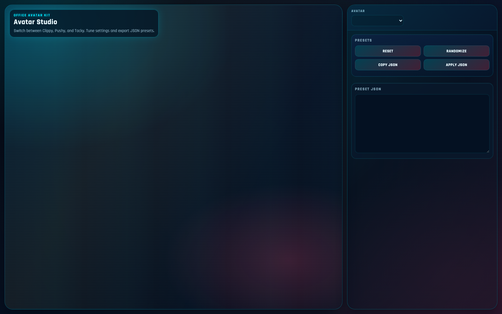

# Office Avatar Studio

Bundled Three.js avatar studio featuring:

- Clippy
- Pushy
- Tacky
- Towely



## What is included

- `index.html`: single studio page for all avatars
- `css/studio.css`: UI styling
- `js/studio.js`: app runtime + dynamic settings panel
- `js/config/avatars.js`: model definitions, defaults, and control schema
- `js/avatars/clippy-controller.js`: Clippy runtime wrapper
- `js/avatars/thumbtack-controller.js`: Pushy/Tacky runtime wrapper
- `js/avatars/towely-controller.js`: Towely runtime wrapper
- `js/lib/realtime-voice.js`: OpenAI Realtime voice WebRTC client for the studio
- `js/lib/visemes.js`: transcript-to-viseme mapping for speech mouth shaping
- `js/lib/clippy-3d.js`: base Clippy model engine
- `js/lib/clippy-3d-plugin-examples.js`: optional Clippy office props plugin
- `js/lib/thumbtack-factory.js`: shared Pushy/Tacky mesh factory
- `js/lib/towely-factory.js`: Towely mesh factory
- `.github/workflows/ci.yml`: CI checks for pull requests and pushes

## Run locally

```bash
npm install
npm run dev -- --host 127.0.0.1 --port 4173
```

Open [http://127.0.0.1:4173](http://127.0.0.1:4173).

## Realtime voice

Use the `Voice: Connect` button in the panel header.

- Preferred: provide an app endpoint at `POST /api/realtime/client_secret` that returns a short-lived Realtime client secret.
- Fallback: the app prompts for an OpenAI API key once and uses it to request a client secret directly.
- Optional globals for development: `window.OPENAI_REALTIME_CLIENT_SECRET` or `window.OPENAI_API_KEY`.

## Clippy Presenter + Excalidraw

Open [http://127.0.0.1:4173/clippy-presentation.html](http://127.0.0.1:4173/clippy-presentation.html).

- Use `Load Demo` for the built-in ServiceNow AI risk deck.
- Import your own `.excalidraw` file from `Scene File`.
- If your scene uses Excalidraw frames, each frame becomes a slide that Clippy can present.

## Build and preview

```bash
npm run build
npm run preview
```

## Checks

```bash
npm run check
```

This runs syntax validation, ESLint, and production bundle build.

## Deploy

This is a static site after build.

1. Run `npm run build`.
2. Deploy the `dist/` directory.

Common host settings:

- Netlify: Build command `npm run build`, Publish directory `dist`
- Vercel: Build command `npm run build`, Output directory `dist`
- Cloudflare Pages: Build command `npm run build`, Build output directory `dist`
