# High-Level Architecture

System overview showing all major subsystems, entry points, and external dependencies.

```mermaid
graph TD
    subgraph Entry Points
        INDEX["index.html<br/><i>Avatar Studio</i>"]
        PRES["clippy-presentation.html<br/><i>Presenter Mode</i>"]
    end

    subgraph Studio Runtime
        STUDIO["js/studio.js<br/>Scene, carousel, controls,<br/>voice dispatch, render loop"]
    end

    subgraph Presentation Runtime
        PRESENTATION["js/presentation.js<br/>Slide deck, Clippy presenter,<br/>Excalidraw rendering"]
    end

    subgraph Avatar System
        AVATARS_CFG["js/config/avatars.js<br/>Definitions, schemas,<br/>default states"]
        ENGINES["js/engines.js<br/>Self-registering<br/>engine registry"]
        CLIPPY_CTRL["avatars/clippy-controller.js"]
        THUMB_CTRL["avatars/thumbtack-controller.js"]
        TOWELY_CTRL["avatars/towely-controller.js"]
    end

    subgraph Mesh Factories
        CLIPPY_3D["lib/clippy-3d.js<br/>Paperclip geometry + plugins"]
        THUMB_FAC["lib/thumbtack-factory.js<br/>Push pin geometry"]
        TOWELY_FAC["lib/towely-factory.js<br/>Towel geometry + shader"]
    end

    subgraph Voice System
        RT_VOICE["lib/realtime-voice.js<br/>OpenAI WebRTC"]
        EL_VOICE["lib/elevenlabs-voice.js<br/>ElevenLabs WebRTC/WS"]
        VISEMES["lib/visemes.js<br/>Text → viseme frames"]
    end

    subgraph Prop System
        PROP_SYS["lib/prop-system.js<br/>Registry + manager"]
        SHARED_PROPS["lib/shared-props.js<br/>Sunglasses, top hat"]
        PLUGIN_EX["lib/clippy-3d-plugin-examples.js<br/>Clippy-specific props"]
    end

    subgraph Utilities
        UTILS["lib/utils.js<br/>clamp, constrainPupil,<br/>randomColor, disposal"]
        CTRL_UTILS["lib/controller-utils.js<br/>Interface validation"]
    end

    subgraph External Dependencies
        THREE["Three.js v0.182.0<br/><i>CDN import map</i>"]
        OPENAI["OpenAI Realtime API<br/><i>WebRTC + data channel</i>"]
        ELEVEN["ElevenLabs<br/>Conversational AI SDK"]
        EXCALI["@excalidraw/excalidraw<br/><i>Slide rendering</i>"]
    end

    INDEX --> STUDIO
    PRES --> PRESENTATION

    STUDIO --> AVATARS_CFG
    STUDIO --> ENGINES
    STUDIO --> RT_VOICE
    STUDIO --> EL_VOICE
    STUDIO --> CTRL_UTILS

    PRESENTATION --> CLIPPY_CTRL
    PRESENTATION --> AVATARS_CFG
    PRESENTATION --> EXCALI

    CLIPPY_CTRL --> CLIPPY_3D
    CLIPPY_CTRL --> ENGINES
    CLIPPY_CTRL --> PROP_SYS
    THUMB_CTRL --> THUMB_FAC
    THUMB_CTRL --> ENGINES
    THUMB_CTRL --> PROP_SYS
    TOWELY_CTRL --> TOWELY_FAC
    TOWELY_CTRL --> ENGINES
    TOWELY_CTRL --> PROP_SYS

    RT_VOICE --> VISEMES
    EL_VOICE --> VISEMES
    RT_VOICE --> OPENAI
    EL_VOICE --> ELEVEN

    SHARED_PROPS --> PROP_SYS
    PLUGIN_EX --> CLIPPY_3D

    STUDIO --> THREE
    PRESENTATION --> THREE
```

## Key Points

- **Two entry points**: `index.html` loads the full studio with carousel and all four avatars. `clippy-presentation.html` loads a standalone Clippy presenter with Excalidraw slides.
- **No build-time bundling of Three.js**: it's loaded via CDN import map in HTML, not through npm.
- **Side-effect imports**: controller modules self-register their engines on import — the studio doesn't need to know which engines exist at compile time.
- **Voice providers are mutually exclusive**: connecting one automatically disconnects the other.
