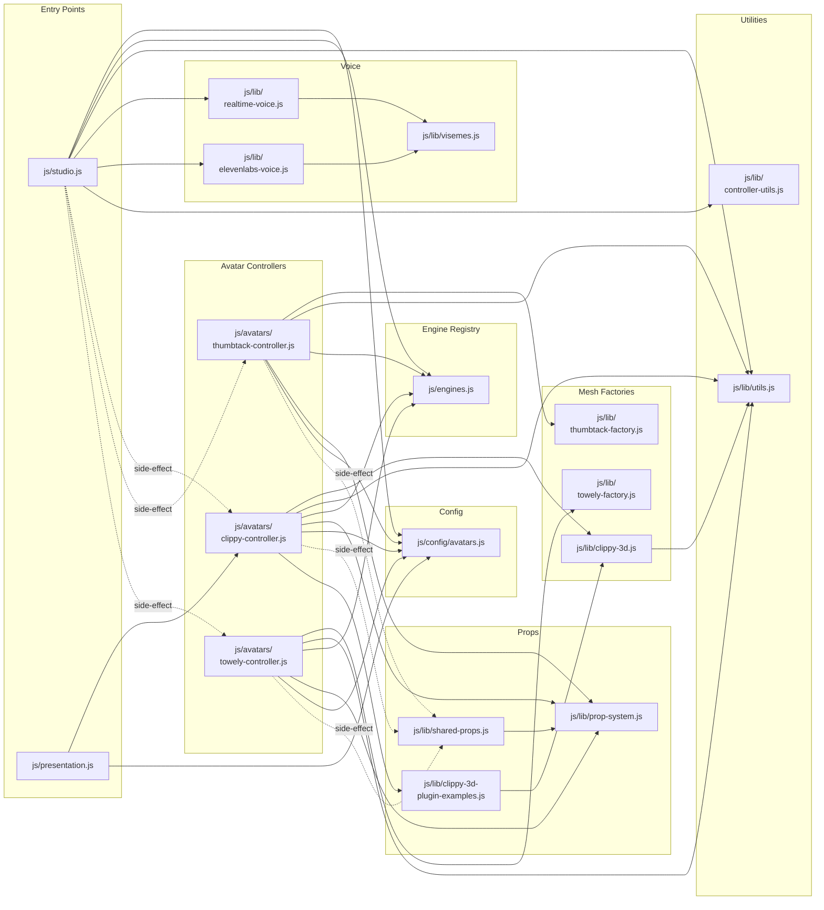

# Module Dependency Graph

Every JS file and its import relationships, grouped by directory.

## Legend

- **Solid arrows** (`-->`) — named imports (`import { x } from ...`)
- **Dashed arrows** (`-.->`) — side-effect imports (`import "./module.js"`) that trigger self-registration

## Import Summary

| Module | Imports From | Imported By |
|--------|-------------|-------------|
| `studio.js` | avatars.js, engines.js, utils.js, realtime-voice.js, elevenlabs-voice.js, controller-utils.js + 3 side-effect | Entry point |
| `presentation.js` | clippy-controller.js, avatars.js | Entry point |
| `engines.js` | _(none)_ | studio.js, all 3 controllers |
| `config/avatars.js` | _(none)_ | studio.js, presentation.js, all 3 controllers |
| `lib/visemes.js` | _(none)_ | realtime-voice.js, elevenlabs-voice.js |
| `lib/utils.js` | _(none)_ | studio.js, clippy-controller.js, thumbtack-controller.js, towely-controller.js, clippy-3d.js |
| `lib/prop-system.js` | _(none)_ | shared-props.js, all 3 controllers |
| `lib/shared-props.js` | prop-system.js | Side-effect import by all 3 controllers |
| `lib/controller-utils.js` | _(none)_ | studio.js |
