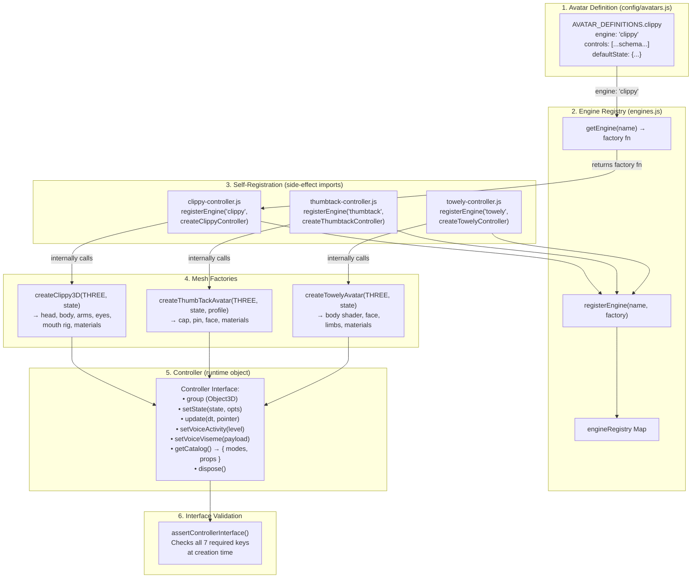

# Engine-Factory-Controller Pipeline

How avatars go from schema definition to running 3D controllers.



## Pipeline Walkthrough

### Step 1: Schema Definitions
`js/config/avatars.js` exports `AVATAR_DEFINITIONS` — a map of avatar IDs to definitions. Each definition declares:
- `engine` — string key matching a registered engine (e.g. `"clippy"`, `"thumbtack"`, `"towely"`)
- `profile` — optional sub-variant (Pushy and Tacky both use `"thumbtack"` engine with different profiles)
- `controls` — array of sections with typed field descriptors for UI generation
- `defaultState` — initial values for all controllable parameters

### Step 2: Self-Registering Engines
Each controller file calls `registerEngine(name, factoryFn)` at module scope. When `studio.js` imports these files as side effects, the engines become available in the global registry.

```js
// In studio.js — side-effect imports trigger registration
import "./avatars/clippy-controller.js";
import "./avatars/thumbtack-controller.js";
import "./avatars/towely-controller.js";
```

### Step 3: Factory Invocation
`studio.js` calls `getEngine(definition.engine)` to retrieve the factory, then invokes it:

```js
const factory = getEngine(definition.engine);
const controller = factory({ THREE, scene, initialState, profile, stageTopY, avatarId });
```

### Step 4: Controller Interface
Every factory must return an object implementing the full controller interface. `assertControllerInterface()` validates this at creation time — missing members throw immediately.

### Engine → Avatar Mapping

| Avatar | Engine Key | Profile | Factory | Controller |
|--------|-----------|---------|---------|------------|
| Clippy | `"clippy"` | — | `createClippy3D` | `createClippyController` |
| Pushy | `"thumbtack"` | `"pushy"` | `createThumbTackAvatar` | `createThumbtackController` |
| Tacky | `"thumbtack"` | `"tacky"` | `createThumbTackAvatar` | `createThumbtackController` |
| Towely | `"towely"` | — | `createTowelyAvatar` | `createTowelyController` |
