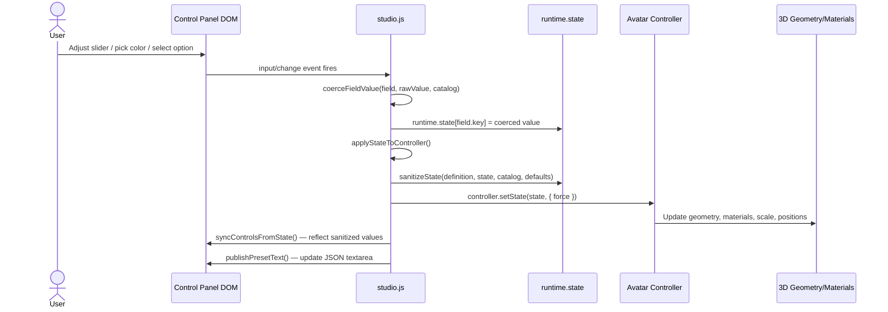
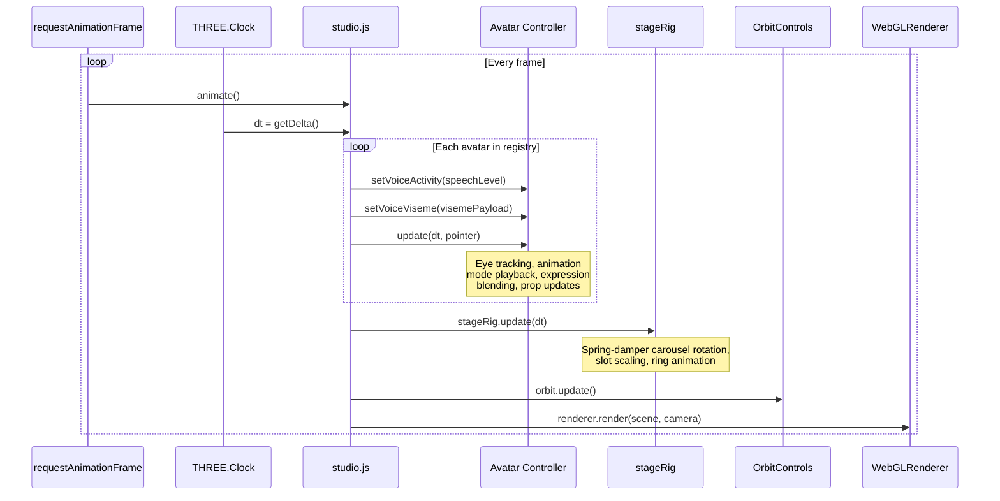
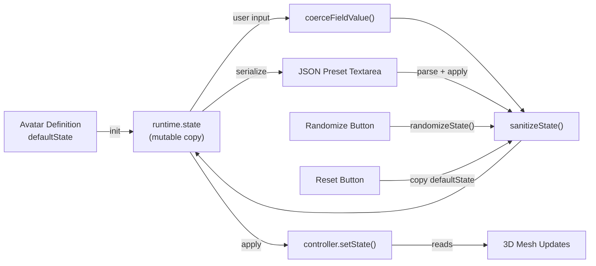

# Avatar Runtime Data Flow

How user interactions flow through the system to update 3D geometry, and how the render loop drives per-frame animation.

## Control Change Flow

## Render Loop

## State Lifecycle

## Key Functions

| Function | Location | Purpose |
|----------|----------|---------|
| `applyStateToController()` | studio.js:753 | Central dispatch: sanitize → setState → sync UI → publish JSON |
| `sanitizeState()` | studio.js:673 | Clamp numbers, validate selects, normalize colors against schema |
| `coerceFieldValue()` | studio.js:654 | Convert raw input value to proper type for a single field |
| `syncControlsFromState()` | studio.js:730 | Push current state values back into DOM inputs |
| `publishPresetText()` | studio.js:748 | Serialize state to JSON textarea |
| `controller.setState()` | Each controller | Apply state object to 3D geometry and materials |
| `controller.update(dt, pointer)` | Each controller | Per-frame animation: eye tracking, mode playback, voice mouth |
