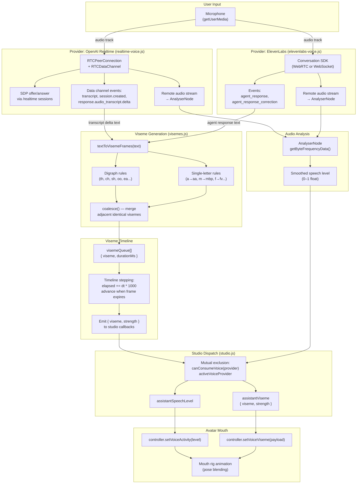

# Voice Pipeline

End-to-end voice integration from microphone input through AI providers to mouth animation.



## Provider Lifecycle

Both providers follow the same pattern:

1. **Connect**: User clicks voice button → acquire microphone → establish WebRTC/WebSocket connection
2. **Session**: Provider sends session configuration (instructions, voice, model)
3. **Streaming**: Audio flows bidirectionally; transcript chunks arrive as events
4. **Viseme generation**: Each transcript chunk is parsed into viseme frames and queued
5. **Disconnect**: User clicks again or provider errors → cleanup audio, close connection

## Mutual Exclusion

Only one voice provider can be active at a time. `handleVoiceConnectionChange()` in studio.js enforces this:

```
Provider A connects → activeVoiceProvider = "A"
                    → Provider B.disconnect({ silent: true })

Provider A disconnects → activeVoiceProvider = null
                       → setAssistantMouth() (reset to silent)
```

## Speech Level Analysis

Both providers create a Web Audio pipeline on the remote audio stream:

```
Remote audio → MediaStreamSource → AnalyserNode → getByteFrequencyData()
                                                 → average speech band (85–255 Hz range)
                                                 → normalize to 0–1
                                                 → smooth with exponential decay
```

The smoothed level drives `setVoiceActivity(level)` on the active avatar, producing subtle mouth movement even between viseme transitions.
