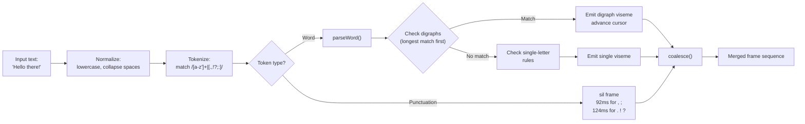
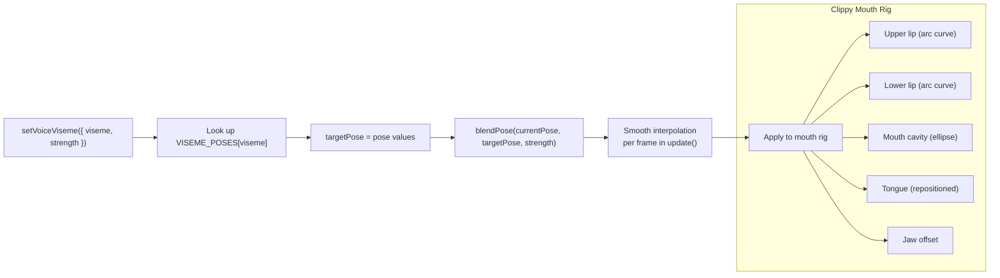

# Viseme & Mouth Animation

The viseme system converts text into mouth shapes and smoothly blends them onto avatar mouth rigs.

## Text-to-Viseme Pipeline

## 12 Viseme Shapes

Each viseme maps to a mouth pose with 5 parameters:

| Viseme | Example Sounds | open | width | round | press | jaw |
|--------|---------------|------|-------|-------|-------|-----|
| `sil` | Silence, M/B/P closed | 0 | 1.0 | 0 | 1.0 | 0 |
| `aa` | f**a**ther, c**a**t | 0.82 | 1.11 | 0.08 | 0.05 | 0.52 |
| `ee` | fl**ee**ce, b**ea**t | 0.32 | 1.30 | -0.14 | 0.08 | 0.12 |
| `oh` | g**oa**t, th**aw** | 0.66 | 0.90 | 0.72 | 0.09 | 0.32 |
| `ou` | g**oo**se, b**oo**t | 0.48 | 0.80 | 0.84 | 0.12 | 0.20 |
| `fv` | **f**ive, **v**ine | 0.16 | 1.02 | 0.02 | 0.45 | 0.04 |
| `mbp` | **m**ap, **b**at, **p**at | 0 | 1.0 | 0 | 1.0 | 0 |
| `th` | **th**ink, **th**is | 0.36 | 1.08 | 0.10 | 0.22 | 0.16 |
| `ch` | **ch**ip, **sh**ip, **j**oy | 0.44 | 1.01 | 0.18 | 0.20 | 0.20 |
| `tn` | **t**ip, **d**ip, **n**ip, **l**ip | 0.24 | 1.08 | 0.04 | 0.28 | 0.10 |
| `ss` | **s**ip, **z**ip, **c**ity | 0.14 | 1.22 | -0.04 | 0.24 | 0.06 |
| `kk` | **k**it, **g**et, **h**it | 0.28 | 1.02 | 0.06 | 0.26 | 0.12 |

## Parsing Rules

**Digraph rules** (checked first, longest pattern wins):

| Pattern | Viseme | Duration |
|---------|--------|----------|
| `tion`, `sion` | ch | 124ms, 118ms |
| `dge`, `ch`, `sh` | ch | 108ms, 102ms, 98ms |
| `th` | th | 96ms |
| `ph` | fv | 90ms |
| `oo`, `ou` | ou | 120ms, 116ms |
| `ow`, `oa`, `aw`, `au` | oh | 112–116ms |
| `ee`, `ea`, `ie`, `ei` | ee | 102–106ms |
| `ai`, `ay` | aa | 104ms |

**Single-letter rules** (fallback for unmatched characters):

| Letters | Viseme | Duration |
|---------|--------|----------|
| a, e | aa | 90–98ms |
| i, y | ee | 86–96ms |
| o | oh | 100ms |
| u, w, r | ou | 90–100ms |
| m, b, p | mbp | 84–88ms |
| f, v | fv | 82ms |
| t, d, n, l | tn | 76–80ms |
| s, z, c, x | ss | 74–76ms |
| k, g, q, h | kk | 76–82ms |
| j | ch | 90ms |

## Pose Blending (Clippy Controller)

### Blending Parameters

- **open**: Controls lip separation (upper/lower lip Y offset)
- **width**: Horizontal mouth stretch (lip scale X)
- **round**: Lip rounding (modifies lip arc curvature)
- **press**: Lip compression (how tightly lips press together)
- **jaw**: Downward jaw displacement

The blend function interpolates linearly between current and target pose each frame, creating smooth transitions between viseme shapes.
