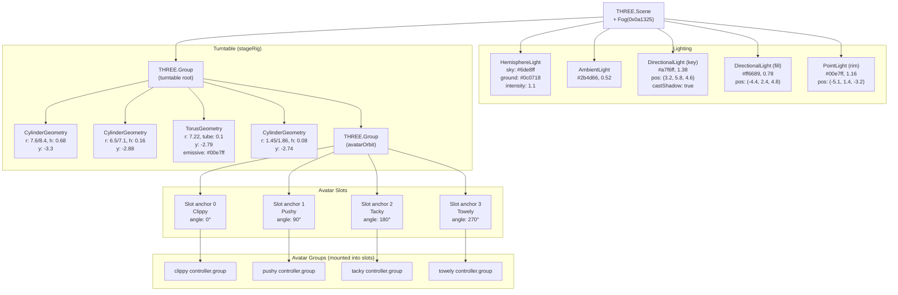
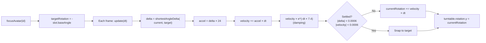

# Scene & Carousel

Three.js scene graph structure, lighting rig, camera setup, and carousel spring-damper physics.

## Scene Graph Hierarchy

## Camera & Controls

| Property | Value |
|----------|-------|
| Camera type | PerspectiveCamera |
| FOV | 45° |
| Position | (0.28, 0.44, 14.2) |
| OrbitControls target | (0, -0.7, 0) |
| Min distance | 7.2 |
| Max distance | 20 |
| Damping | enabled |

## Carousel Physics

The carousel uses a **spring-damper** system to smoothly rotate to the selected avatar:

### Slot Presentation

Each frame, slots are updated based on their angular position relative to the camera:

- **Scale**: Slots closer to the camera (front) are larger (0.58–0.82), with a +0.1 boost for the selected avatar
- **Y position**: Front slots float slightly higher
- **Counter-rotation**: Each slot's Y rotation counteracts the turntable spin so avatars always face the camera

### Decorative Animations

- **Outer ring**: Continuously rotates Z at 0.34 rad/s
- **Center plate**: Continuously rotates Y at -0.42 rad/s

## Renderer Configuration

| Property | Value |
|----------|-------|
| Antialiasing | enabled |
| Alpha | true (transparent background) |
| Pixel ratio | min(devicePixelRatio, 2) |
| Color space | SRGBColorSpace |
| Shadow map | PCFSoftShadowMap, 1024x1024 |
