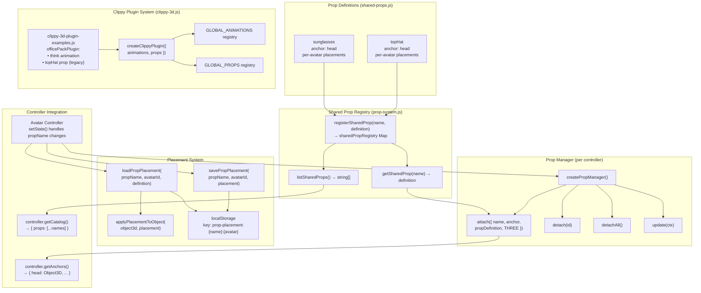
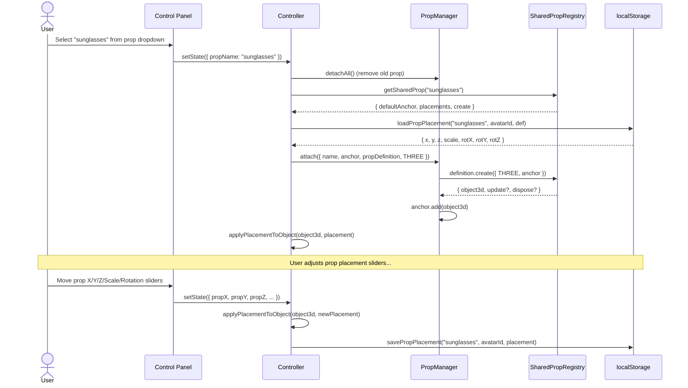

# Prop System

The prop system lets any Object3D be attached to named anchor points on avatars. It has two layers: the shared prop registry (cross-avatar) and Clippy's legacy plugin system.

## Architecture

## Prop Lifecycle

## Placement Resolution Order

When loading a prop's placement for a specific avatar:

1. **localStorage** — User's saved custom placement (highest priority)
2. **Prop definition placements** — Per-avatar defaults from the prop definition (e.g., different sunglasses positions for Clippy vs Towely)
3. **Global defaults** — `{ x: 0, y: 0.3, z: 0, scale: 1, rotX: 0, rotY: 0, rotZ: 0 }`

## Registered Shared Props

| Prop | Anchor | Description |
|------|--------|-------------|
| `sunglasses` | head | Dark reflective lens pair with wire frame and temple arms |
| `topHat` | head | Classic cylinder top hat with brim |

Both define per-avatar placements for all four avatars (clippy, pushy, tacky, towely) to account for different head sizes and positions.
