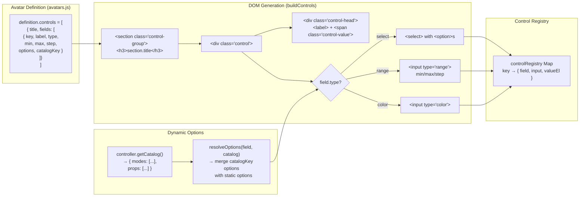
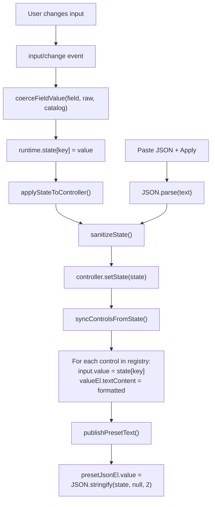

# Schema-Driven UI

The control panel is entirely generated from avatar definition schemas — no hardcoded UI per avatar.

## Generation Flow



## State Sync Cycle



## Control Schema Types

### `select`
```js
{ key: "mode", label: "Animation", type: "select",
  options: ["idle", "wave", "celebrate"],  // static fallback
  catalogKey: "modes" }                     // dynamic override from getCatalog()
```
- Generates `<select>` element
- `catalogKey` allows controllers to provide runtime-dynamic options
- Special handling for `propName` field: always includes `NO_PROP_VALUE` ("__none__")

### `range`
```js
{ key: "scale", label: "Body Scale", type: "range",
  min: 0.35, max: 2.2, step: 0.01 }
```
- Generates `<input type="range">`
- Values clamped to [min, max] by `coerceFieldValue()`
- Display precision auto-detected from step decimals
- Optional `format: "speed"` for `1.00x` display

### `color`
```js
{ key: "metalColor", label: "Metal", type: "color" }
```
- Generates `<input type="color">`
- Values stored as hex strings (e.g., `"#e7edf6"`)

## Control Sections per Avatar

| Avatar | Sections |
|--------|----------|
| Clippy | Behavior (mode, expression, prop, speed), Prop Placement (7 fields), Shape (19 fields), Materials (9 fields) |
| Pushy/Tacky | Behavior (mode, expression, prop, speed), Prop Placement (7 fields), Shape (15 fields), Materials (10 fields) |
| Towely | Behavior (mode, expression, prop, speed), Prop Placement (7 fields), Shape (19 fields), Materials (12 fields) |

## Preset System

The JSON textarea provides import/export of the full state:

- **Copy**: `JSON.stringify(runtime.state, null, 2)` → clipboard
- **Apply**: `JSON.parse(text)` → merge with current state → sanitize → apply
- **Reset**: Copy `definition.defaultState` → sanitize → apply
- **Randomize**: Generate random values within field bounds → sanitize → apply
