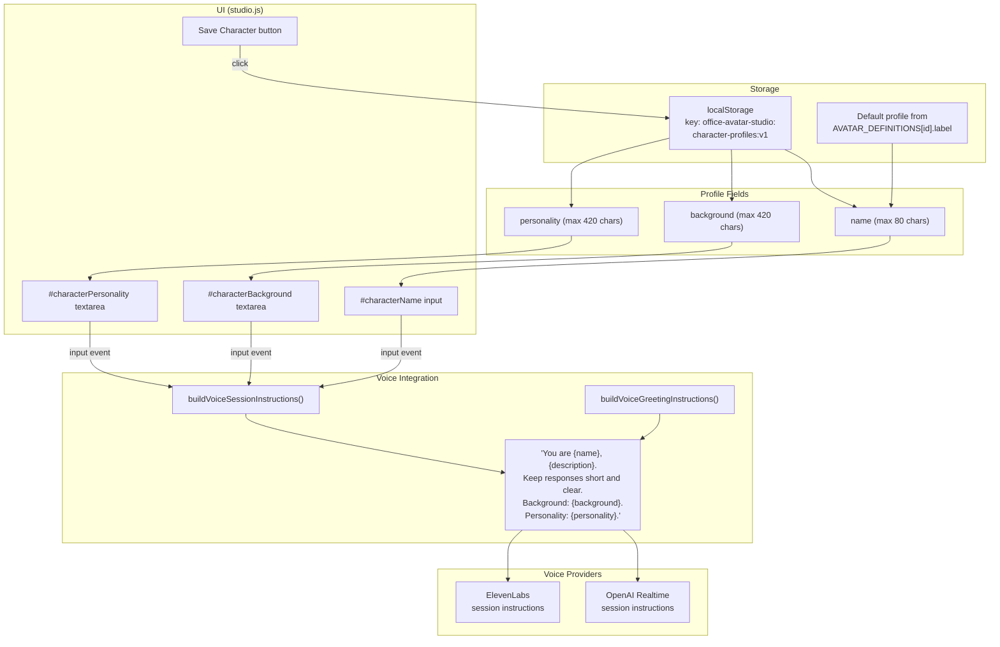
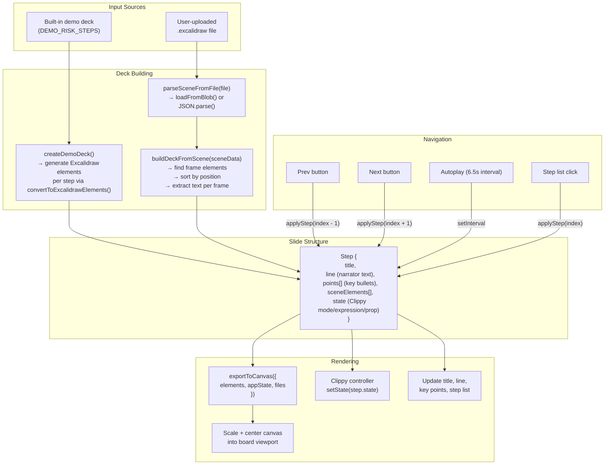

# Character Profiles & Presentation Mode

## Character Profiles

Each avatar has an editable character profile that shapes voice session behavior.

### Profile Data Flow



### Profile Lifecycle

1. **Load**: On init, profiles are loaded from localStorage (or defaults from avatar labels)
2. **Edit**: Input changes trigger a 500ms debounced autosave
3. **Save**: Explicit save button also triggers `syncSessionContext()` on both voice providers
4. **Switch avatar**: `loadAvatar()` calls `syncCharacterProfileInputs()` to update the form
5. **Voice session**: `buildVoiceSessionInstructions()` assembles profile into LLM system prompt

### Instruction Building

```js
buildVoiceSessionInstructions() → string:
  "You are {displayName}, {description}."
  "You are speaking with the user by realtime voice."
  "Keep responses short, clear, and conversational unless the user asks for details."
  "Ask one focused follow-up question when useful."
  + "Character background: {background}."  // if provided
  + "Personality and behavior: {personality}."  // if provided
```

---

## Presentation Mode

`clippy-presentation.html` provides a standalone Clippy presenter that cycles through Excalidraw slides.

### Presentation Flow



### Excalidraw Scene Parsing

When a user uploads an `.excalidraw` file:

1. **Load**: `loadFromBlob()` (Excalidraw API) or fallback `JSON.parse()`
2. **Find frames**: Filter elements with `type === "frame"`, sort by Y then X position
3. **Per frame**: Find child elements inside frame bounds, extract text blocks
4. **Build steps**: First text block → title, remaining → key points
5. **Assign Clippy state**: Cycle through animation modes and expressions per slide

### Clippy State Cycling

Each slide gets a Clippy mode and expression based on its index:

```
Modes:      wave → think → point → idle → celebrate → wave → ...
Expressions: happy → focused → neutral → surprised → happy → ...
```

Special overrides:
- Slides with "risk/critical/attack" in the title → `expression: "focused"`
- Slides with "decision/go-live" in the title → `expression: "happy"`
- First and last slides get the `topHat` prop

### Scene Structure

The presentation uses its own Three.js scene (separate from the studio):
- Clippy positioned at center stage on a rotating platform
- Fog, hemisphere light, fill light, rim light, ambient light
- OrbitControls with restricted zoom/pan
- Decorative ring element with continuous rotation
